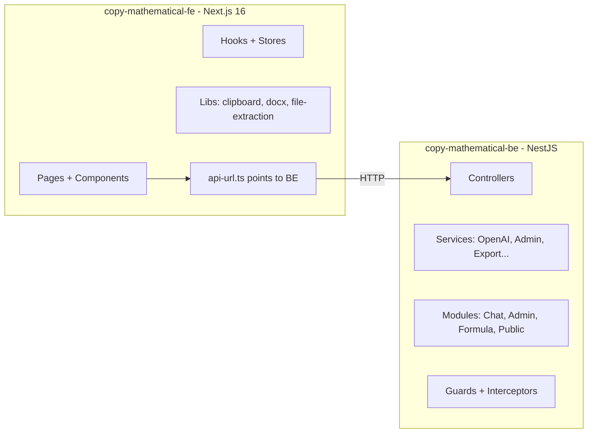

# Plan: Tách Project thành FE + BE riêng biệt

## Tổng quan

Tách monolith Next.js app hiện tại thành 2 project độc lập:

- **FE**: `d:/Project - Devoloper/Remote-job/copy-mathematical-fe/` — Next.js 16, giữ nguyên UI/components
- **BE**: `d:/Project - Devoloper/Remote-job/copy-mathematical-be/` — NestJS + TypeScript

## Kiến trúc hiện tại

```
copy-mathematical/
├── src/app/api/          ← 7 API routes (sẽ chuyển sang BE)
│   ├── chat/route.ts
│   ├── export-variants/route.ts
│   ├── recognize-formula/route.ts
│   ├── admin/users/route.ts
│   ├── admin/activity/route.ts
│   ├── admin/provider/route.ts
│   ├── admin/settings/route.ts
│   └── public/settings/route.ts
├── src/lib/              ← Shared libraries (phân loại bên dưới)
├── src/components/       ← FE only
├── src/hooks/            ← FE only
├── src/stores/           ← FE only
└── src/types/            ← Shared types
```

## Phân loại Libraries

| File | Thuộc về | Lý do |
|------|----------|-------|
| openai.ts | BE | AI Gateway calls, env secrets |
| admin-store.ts | BE | File-based JSON store, fs/crypto |
| cors.ts | BE | CORS config cho NestJS |
| prompts.ts | BE | System prompts cho AI |
| teacher-research.ts | BE | Research sub-agent logic |
| teacher-research-intent.ts | BE | Intent detection |
| agents/teacher-test-agent.ts | BE | Agent orchestration |
| export-drafts.ts | BE | Export variant normalization |
| guest-access.ts | BE | Guest rate limiting |
| attachment-content.ts | BE | Build message text from attachments |
| clipboard.ts | FE | Browser Clipboard API |
| docx-generator.ts | FE | Client-side DOCX generation |
| file-extraction.ts | FE | Client-side PDF/Excel parsing |
| mock-auth.ts | FE | localStorage auth |
| api-url.ts | FE | API base URL resolution |
| utils.ts | FE | cn() Tailwind helper |
| math-utils.ts | SHARED | Used by both export-variants route + FE components |
| assistant-modes.ts | SHARED | Used by chat route + FE UI |
| types/index.ts | SHARED | TypeScript interfaces |

## Kiến trúc mới



## BE Structure (NestJS)

```
copy-mathematical-be/
├── package.json
├── tsconfig.json
├── tsconfig.build.json
├── nest-cli.json
├── .env.example
├── .gitignore
├── src/
│   ├── main.ts                         ← Bootstrap NestJS app + CORS
│   ├── app.module.ts                   ← Root module
│   │
│   ├── chat/
│   │   ├── chat.module.ts
│   │   ├── chat.controller.ts          ← POST /api/chat (streaming)
│   │   ├── chat.service.ts             ← Business logic from route.ts
│   │   └── dto/
│   │       └── chat-request.dto.ts
│   │
│   ├── export/
│   │   ├── export.module.ts
│   │   ├── export.controller.ts        ← POST /api/export-variants
│   │   ├── export.service.ts
│   │   └── dto/
│   │       └── export-request.dto.ts
│   │
│   ├── formula/
│   │   ├── formula.module.ts
│   │   ├── formula.controller.ts       ← POST /api/recognize-formula
│   │   ├── formula.service.ts
│   │   └── dto/
│   │       └── recognize-request.dto.ts
│   │
│   ├── admin/
│   │   ├── admin.module.ts
│   │   ├── users/
│   │   │   ├── users.controller.ts     ← GET/POST/PATCH/DELETE /api/admin/users
│   │   │   └── users.service.ts
│   │   ├── activity/
│   │   │   ├── activity.controller.ts  ← GET /api/admin/activity
│   │   │   └── activity.service.ts
│   │   ├── provider/
│   │   │   ├── provider.controller.ts  ← GET/POST /api/admin/provider
│   │   │   └── provider.service.ts
│   │   ├── settings/
│   │   │   ├── settings.controller.ts  ← GET/POST /api/admin/settings
│   │   │   └── settings.service.ts
│   │   ├── dto/
│   │   │   ├── create-user.dto.ts
│   │   │   ├── update-user.dto.ts
│   │   │   └── update-settings.dto.ts
│   │   └── guards/
│   │       └── admin.guard.ts          ← Check x-admin-user header
│   │
│   ├── public/
│   │   ├── public.module.ts
│   │   └── public-settings.controller.ts  ← GET /api/public/settings
│   │
│   ├── shared/
│   │   ├── shared.module.ts            ← Global shared module
│   │   ├── services/
│   │   │   └── openai.service.ts       ← AI Gateway logic from openai.ts
│   │   ├── lib/
│   │   │   ├── math-utils.ts           ← Copy shared
│   │   │   ├── assistant-modes.ts      ← Copy shared
│   │   │   ├── prompts.ts
│   │   │   ├── export-drafts.ts
│   │   │   ├── attachment-content.ts
│   │   │   ├── guest-access.ts
│   │   │   ├── teacher-research.ts
│   │   │   ├── teacher-research-intent.ts
│   │   │   └── agents/
│   │   │       └── teacher-test-agent.ts
│   │   └── store/
│   │       └── admin-store.ts          ← File-based JSON store
│   │
│   └── types/
│       └── index.ts                    ← Shared TypeScript interfaces
```

## FE Structure (changes from current)

```
copy-mathematical-fe/
├── package.json                    ← Remove server-only deps (none needed)
├── next.config.ts
├── tsconfig.json
├── .env.local.example              ← Only NEXT_PUBLIC_API_BASE_URL
├── src/
│   ├── app/                        ← Remove api/ folder entirely
│   │   ├── layout.tsx
│   │   ├── page.tsx
│   │   ├── about/
│   │   ├── admin/
│   │   ├── dashboard/
│   │   ├── login/
│   │   ├── newchat/
│   │   ├── pricing/
│   │   ├── product/
│   │   ├── teacher/
│   │   └── workflow/
│   ├── components/                 ← Copy as-is
│   ├── hooks/                      ← Copy as-is
│   ├── stores/                     ← Copy as-is
│   ├── lib/
│   │   ├── api-url.ts             ← Simplified, always use NEXT_PUBLIC_API_BASE_URL
│   │   ├── clipboard.ts           ← As-is
│   │   ├── docx-generator.ts      ← As-is
│   │   ├── file-extraction.ts     ← As-is
│   │   ├── math-utils.ts          ← Copy shared
│   │   ├── assistant-modes.ts     ← Copy shared
│   │   ├── mock-auth.ts           ← As-is
│   │   ├── utils.ts               ← As-is
│   │   ├── test-paper.ts          ← As-is
│   │   └── test-pdf-export.ts     ← As-is
│   └── types/
│       └── index.ts               ← Copy shared types
```

## BE Dependencies (NestJS)

```json
{
  "dependencies": {
    "@nestjs/common": "^11.0.0",
    "@nestjs/core": "^11.0.0",
    "@nestjs/platform-express": "^11.0.0",
    "@nestjs/config": "^4.0.0",
    "class-transformer": "^0.5.1",
    "class-validator": "^0.14.1",
    "reflect-metadata": "^0.2.2",
    "rxjs": "^7.8.1"
  },
  "devDependencies": {
    "@nestjs/cli": "^11.0.0",
    "@types/node": "^20",
    "typescript": "^5",
    "ts-node": "^10.9.2"
  }
}
```

## API Contract (giữ nguyên 100%)

| Method | Path | Body | Response |
|--------|------|------|----------|
| POST | /api/chat | `{messages, mode}` | Text stream (SSE) |
| POST | /api/export-variants | `{content, request}` | `{variants}` |
| POST | /api/recognize-formula | `{imageDataUrl}` | `{latex, debug}` |
| GET | /api/admin/users | - | `{users}` |
| POST | /api/admin/users | `{username, displayName, role, scope}` | `{user, users}` |
| PATCH | /api/admin/users | `{id, ...fields}` | `{user, users}` |
| DELETE | /api/admin/users | `{id}` | `{users}` |
| GET | /api/admin/activity | - | `{activity}` |
| GET | /api/admin/provider | - | `{provider, config}` |
| POST | /api/admin/provider | `{provider}` | `{provider}` |
| GET | /api/admin/settings | - | `{settings}` |
| POST | /api/admin/settings | `{guestChatLimit}` | `{settings}` |
| GET | /api/public/settings | - | `{guestChatLimit, hasRuntimeApi}` |

## NestJS-specific Patterns

### Streaming (Chat endpoint)
```typescript
// chat.controller.ts
@Post()
async chat(@Body() dto: ChatRequestDto, @Res() res: Response) {
  res.setHeader('Content-Type', 'text/plain; charset=utf-8');
  res.setHeader('Transfer-Encoding', 'chunked');
  res.setHeader('Cache-Control', 'no-cache');

  const text = await this.chatService.generateResponse(dto);
  // Stream text in chunks
  const encoder = new TextEncoder();
  const chunks = this.chatService.splitIntoChunks(text);
  for (const chunk of chunks) {
    res.write(encoder.encode(chunk));
    await new Promise(r => setTimeout(r, 12));
  }
  res.end();
}
```

### Admin Guard
```typescript
// admin.guard.ts
@Injectable()
export class AdminGuard implements CanActivate {
  canActivate(context: ExecutionContext): boolean {
    const request = context.switchToHttp().getRequest();
    return request.headers['x-admin-user'] === 'admin123';
  }
}
```

### OpenAI Service (Injectable)
```typescript
// openai.service.ts
@Injectable()
export class OpenAIService {
  // Wrap all logic from current openai.ts
  // Use @nestjs/config for env vars via ConfigService
  constructor(private config: ConfigService) {}

  async generateText(options: GenerateTextOptions): Promise<string> { ... }
  getModel(purpose: AIModelPurpose): string { ... }
  getProviderSetupError(): string | null { ... }
}
```

## Migration Steps (chi tiết)

### Phase 1: Tạo BE project (NestJS)

1. Tạo folder `copy-mathematical-be/` bằng NestJS CLI hoặc manual setup
2. Setup `nest-cli.json`, `tsconfig.json`, `tsconfig.build.json`
3. Tạo `AppModule` với `ConfigModule.forRoot()` cho env vars
4. Tạo `SharedModule` (global) chứa `OpenAIService`
5. Copy + adapt libs vào `src/shared/lib/`:
   - openai.ts → openai.service.ts (Injectable, dùng ConfigService)
   - admin-store.ts → giữ nguyên logic, wrap trong service
   - prompts.ts, math-utils.ts, assistant-modes.ts, export-drafts.ts, guest-access.ts, attachment-content.ts, teacher-research.ts, teacher-research-intent.ts, agents/ → copy as-is
6. Tạo `ChatModule`:
   - ChatController: POST /api/chat (streaming response)
   - ChatService: logic từ chat/route.ts
7. Tạo `ExportModule`:
   - ExportController: POST /api/export-variants
   - ExportService: logic từ export-variants/route.ts
8. Tạo `FormulaModule`:
   - FormulaController: POST /api/recognize-formula
   - FormulaService: logic từ recognize-formula/route.ts
9. Tạo `AdminModule`:
   - AdminGuard cho auth
   - UsersController + UsersService
   - ActivityController + ActivityService
   - ProviderController + ProviderService
   - SettingsController + SettingsService
10. Tạo `PublicModule`:
    - PublicSettingsController: GET /api/public/settings
11. Setup CORS trong `main.ts`
12. Tạo `.env.example`
13. Test tất cả endpoints: `npm run start:dev`

### Phase 2: Tạo FE project

14. Copy toàn bộ project hiện tại sang `copy-mathematical-fe/`
15. Xóa folder `src/app/api/` hoàn toàn
16. Xóa BE-only libs: openai.ts, admin-store.ts, cors.ts, prompts.ts, teacher-research.ts, teacher-research-intent.ts, export-drafts.ts, guest-access.ts, attachment-content.ts, agents/
17. Cập nhật `.env.local.example` — chỉ giữ `NEXT_PUBLIC_*` vars
18. Cập nhật `api-url.ts` — luôn require `NEXT_PUBLIC_API_BASE_URL`
19. Verify build pass: `npm run build`

### Phase 3: Integration test

20. Chạy BE: `cd copy-mathematical-be && npm run start:dev` (port 3001)
21. Chạy FE: `cd copy-mathematical-fe && npm run dev` (port 3000) với `NEXT_PUBLIC_API_BASE_URL=http://localhost:3001`
22. Test flow: chat, export, formula recognition, admin dashboard
23. Verify CORS hoạt động đúng

## Phase 4: Docker Deployment

### Docker file structure

```
copy-mathematical-be/
├── Dockerfile
├── .dockerignore

copy-mathematical-fe/
├── Dockerfile
├── .dockerignore

docker-compose.yml              ← Đặt ở folder cha hoặc riêng
```

### BE Dockerfile

```dockerfile
# --- Build stage ---
FROM node:20-alpine AS builder
WORKDIR /app
COPY package.json package-lock.json ./
RUN npm ci
COPY . .
RUN npm run build

# --- Production stage ---
FROM node:20-alpine AS runner
WORKDIR /app
ENV NODE_ENV=production
COPY --from=builder /app/dist ./dist
COPY --from=builder /app/node_modules ./node_modules
COPY --from=builder /app/package.json ./
EXPOSE 3001
CMD ["node", "dist/main.js"]
```

### FE Dockerfile

```dockerfile
# --- Build stage ---
FROM node:20-alpine AS builder
WORKDIR /app
COPY package.json package-lock.json ./
RUN npm ci
COPY . .
ARG NEXT_PUBLIC_API_BASE_URL
ENV NEXT_PUBLIC_API_BASE_URL=$NEXT_PUBLIC_API_BASE_URL
RUN npm run build

# --- Production stage ---
FROM node:20-alpine AS runner
WORKDIR /app
ENV NODE_ENV=production
COPY --from=builder /app/.next/standalone ./
COPY --from=builder /app/.next/static ./.next/static
COPY --from=builder /app/public ./public
EXPOSE 3000
CMD ["node", "server.js"]
```

> FE cần thêm `output: "standalone"` trong next.config.ts để Next.js tạo minimal production server.

### docker-compose.yml

```yaml
services:
  backend:
    build:
      context: ./copy-mathematical-be
      dockerfile: Dockerfile
    ports:
      - "3001:3001"
    env_file:
      - ./copy-mathematical-be/.env
    restart: unless-stopped
    healthcheck:
      test: ["CMD", "wget", "--spider", "-q", "http://localhost:3001/api/public/settings"]
      interval: 30s
      timeout: 5s
      retries: 3

  frontend:
    build:
      context: ./copy-mathematical-fe
      dockerfile: Dockerfile
      args:
        NEXT_PUBLIC_API_BASE_URL: http://backend:3001
    ports:
      - "3000:3000"
    depends_on:
      backend:
        condition: service_healthy
    restart: unless-stopped
```

### .dockerignore (dùng chung pattern cho cả 2)

```
node_modules
.next
dist
.env
.env.local
.git
*.md
.admin-data
```

### Migration Steps bổ sung (Phase 4)

24. Thêm `output: "standalone"` vào `next.config.ts` của FE
25. Tạo Dockerfile cho BE (multi-stage: build + production)
26. Tạo Dockerfile cho FE (multi-stage: build + standalone)
27. Tạo docker-compose.yml ở folder cha
28. Tạo .dockerignore cho cả 2 project
29. Test: `docker compose up --build`
30. Verify FE gọi BE qua internal Docker network (service name `backend`)

---

## Lưu ý quan trọng

- **Không đụng logic code**: Chỉ chuyển đổi transport layer. Business logic giữ nguyên 100%.
- **Stream response**: Chat route dùng `@Res()` decorator để bypass NestJS interceptor và stream trực tiếp.
- **Global prefix**: Set `app.setGlobalPrefix('api')` trong `main.ts` để tất cả routes tự có prefix `/api/`.
- **Validation**: Dùng `class-validator` + `ValidationPipe` cho DTOs.
- **Admin auth**: `AdminGuard` check header `x-admin-user`. Apply via `@UseGuards(AdminGuard)` trên admin controllers.
- **File storage**: `admin-store.ts` dùng `.admin-data/` folder relative to `process.cwd()`. Giữ nguyên.
- **GitHub Pages deploy**: FE vẫn support `output: "export"` cho static deploy, trỏ API tới BE deployed elsewhere.
- **ConfigService**: Thay thế tất cả `process.env.X` trong openai.ts bằng `this.config.get('X')`.
- **Docker networking**: Trong docker-compose, FE build với `NEXT_PUBLIC_API_BASE_URL=http://backend:3001` (internal DNS). Nếu FE gọi API từ browser (client-side), cần expose BE ra public URL và set `NEXT_PUBLIC_API_BASE_URL` thành URL public đó.
- **Production deploy**: Có thể deploy BE lên Railway/Render/Fly.io, FE lên Vercel/Netlify. Hoặc dùng docker-compose trên VPS.
